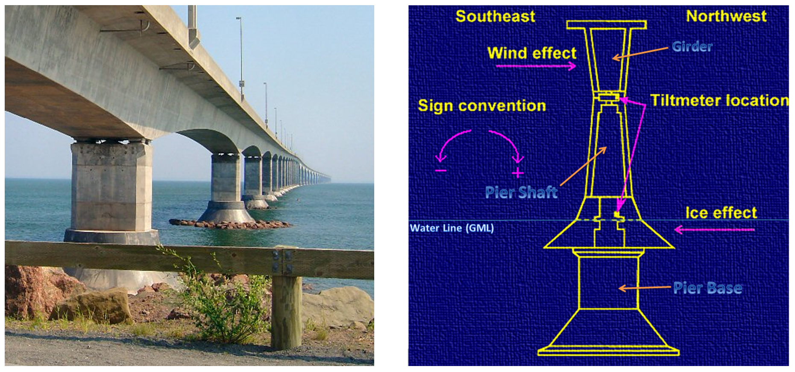
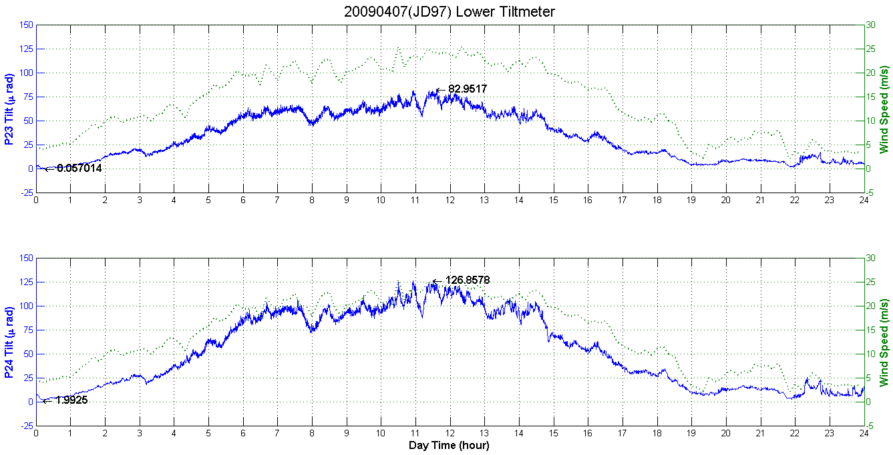
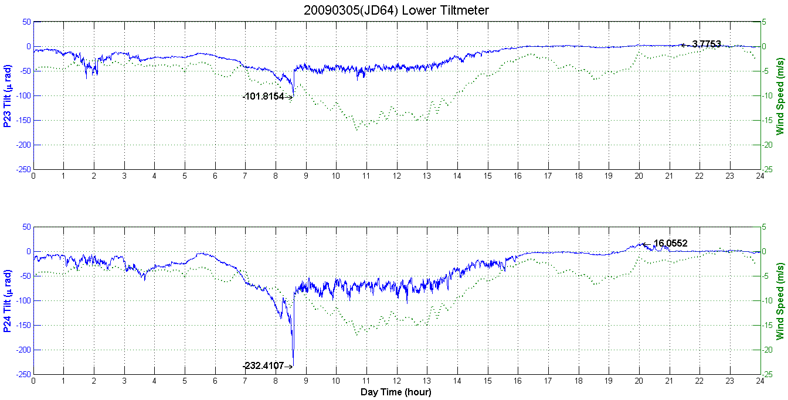
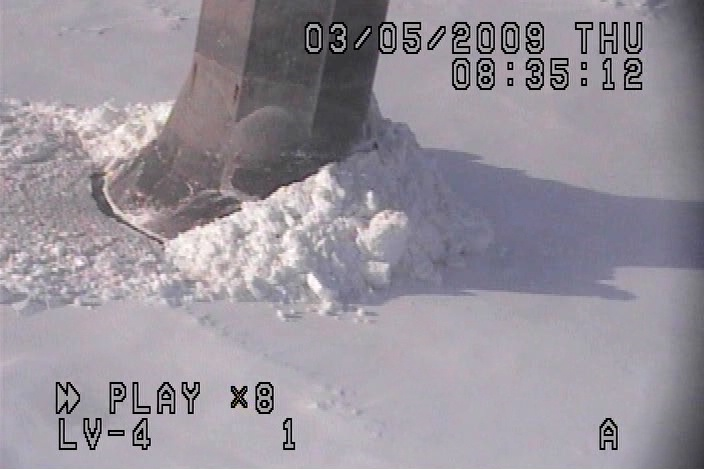

# Response of Confederation Bridge to Ice Forces: Winter 2008-2010, 2010
In order to evaluate the ice impact force acting on offshore structures, two piers (P23 and P24) of the Confederation Bridge were selected as a test bed for the study of ice interactions. The tiltmeter operated 12 winters since 1998 and obtained a reliable tilt data from two bridge piers adjacent the navigation span. In this project, data from 2008-2010 was analyzed. The data is the measurement of structure’s tilt angle created by ice and wind forces. For the purpose of removing the wind effect, the wind data is provided to calculate a correction to the ice force. Both wind data and tilt data are converted into local standard time (LST) for matching with the time on video recording. The video record collects the information of ice condition and ice behaviour around the P23 and the ice chart provides the information of ice thickness and concentration near the bridge. The wind data and ice data are averaged every 15 seconds for creating a wind-ice plot. By comparing the tilt and wind plots, an ice event can be determined and the event with the highest peak angle caused by ice impaction will be selected to calculate the largest ice force in this year. Associating with video records and ice chart, an extreme ice event can be assured, and the ice force is created when an ice floe collides with the bridge pier and fails into pieces. The tiltmeter has a high value to research and a large area to develop because it can not only be used to measure ice force but also used to analyze wind effect.  

[Report](Report.pdf "Project Presentation PDF")

### Tiltmeters inside Pier
  
Lower Tiltmeter is the tiltmeter located at the Water Line.  

### Tiltmeter's Measurement of Wind Condition Only

### Tiltmeter's Measurement of Ice Event in Windy Condition

### Ice Event Scene

